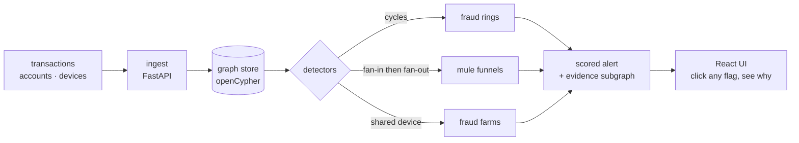

<!-- ═══════════════════════════════════════════════════════════════ -->
<!--  Gajendra Dhanoliya — minimalist, bold profile                   -->
<!--  Theme-aware: tuned variants for GitHub light & dark mode        -->
<!--                                                                  -->
<!--  Generated pieces — edit the generator, not the output:          -->
<!--   · RECENT WORK block ........ scripts/update_readme.py          -->
<!--   · assets/*-3d-*.svg ....... scripts/gen_3d_assets.py          -->
<!--   · assets/snake-*.svg ....... .github/workflows/visuals.yml     -->
<!--   · profile-3d-contrib/ ...... .github/workflows/visuals.yml     -->
<!-- ═══════════════════════════════════════════════════════════════ -->

<br/>

<!-- ░░░ BIG BOLD HERO STATEMENT (theme-aware) ░░░ -->
<p align="center">
  
  
</p>

<!-- ░░░ 3D: a transaction ring rotating in real perspective ░░░ -->
<!-- Geometry is projected in Python and baked into SMIL keyframes, so it
     animates on GitHub without a line of JavaScript. -->
<p align="center">
  
  
</p>

<!-- ░░░ MINIMAL TOP NAV ░░░ -->
<p align="center">
  <a href="#selected-work"><b>WORK</b></a> &nbsp;&nbsp;·&nbsp;&nbsp;
  <a href="#how-it-fits-together"><b>HOW IT WORKS</b></a> &nbsp;&nbsp;·&nbsp;&nbsp;
  <a href="#what-i-work-with"><b>STACK</b></a> &nbsp;&nbsp;·&nbsp;&nbsp;
  <a href="https://www.linkedin.com/in/gajendradhanoliya-dhanoliya-813345359/"><b>ABOUT</b></a> &nbsp;&nbsp;·&nbsp;&nbsp;
  <a href="https://codeforces.com/profile/G.Dhanoliya"><b>PLAY</b></a> &nbsp;&nbsp;·&nbsp;&nbsp;
  <a href="mailto:gajendradhanoliya01@gmail.com"><b>SAY HI</b></a>
</p>

<br/>

<!-- ░░░ TYPING SUB-HEADLINE ░░░ -->
<p align="center">
  
</p>

<br/>

<!-- ═══════════════════════════════════════════════════════════════ -->

<h2 align="center">Hey — I'm Gajendra 👋</h2>

<p align="center" width="100%">
  <i>I help ideas turn into systems that don't fall over.<br/>
  Backend, distributed infra, and AI that ships to production —<br/>
  built at IIT Delhi, sharpened on 1000+ competitive problems.</i>
</p>

<p align="center">
  
  
  
  
  
</p>

<br/>

<!-- ═══════════════════════════════════════════════════════════════ -->

<h2 align="center">🟢 LIVE RIGHT NOW</h2>

<p align="center">
  <sub>Three of these are deployed and open. No sign-up — the demo accounts are below each one.</sub>
</p>

<p align="center">
  <a href="https://sentinelgraph.vercel.app">
    
    
  </a>
</p>

<p align="center">
  <i>Fraud is never visible in one row. Ten accounts each sending $4,000 into one account<br/>
  that wires 95% of it offshore is a mule funnel — a shape in the network, not a record.</i>
</p>

<p align="center">
  <a href="https://sentinelgraph.vercel.app"></a>
  <a href="https://github.com/dhanoliya-ji/sentinelgraph"></a>
  <a href="https://github.com/dhanoliya-ji/sentinelgraph/blob/main/docs/walkthrough.md"></a>
</p>

<p align="center">
  
  
  
  
</p>

<br/>

<!-- ░░░ the other two live deployments ░░░ -->
<table align="center" width="100%">
  <tr>
    <td align="center" width="420">
      <a href="https://routeos-frontend.onrender.com">
        
        
      </a>
      <p>
        <a href="https://routeos-frontend.onrender.com"></a>
        <a href="https://routeos-backend-h5x6.onrender.com/docs"></a>
      </p>
      <sub>One-click sign-in as <code>dispatcher@routeos.dev</code> · <code>dispatch12345</code></sub>
    </td>
    <td align="center" width="420">
      <a href="https://crucible-web.onrender.com">
        
        
      </a>
      <p>
        <a href="https://crucible-web.onrender.com"></a>
        <a href="https://online-coding-judge-7w5q.onrender.com/docs"></a>
      </p>
      <sub>Sign in as <code>demo@example.com</code> · <code>DemoPass123</code></sub>
    </td>
  </tr>
</table>

<p align="center">
  <sub>⏱️ Both APIs run on a free tier that sleeps when idle — the first request can take up to a minute<br/>
  to wake the container. The web apps are static and answer instantly.</sub>
</p>

<br/>

<!-- ░░░ 3D: RouteOS, in one picture — vans driving a plan across a ground plane ░░░ -->
<p align="center">
  
  
</p>

<p align="center">
  <sub>Three vehicles, one depot, capacity and time windows respected. The plane recedes,<br/>
  so a van further up the picture really is further away — it is smaller because the projection says so.</sub>
</p>

<br/>

<!-- ═══════════════════════════════════════════════════════════════ -->

<h2 align="center" id="how-it-fits-together">HOW IT FITS TOGETHER</h2>

<p align="center"><sub>The shape of SentinelGraph — and roughly how I build everything else.</sub></p>

<!-- ░░░ 3D: the same architecture as isometric layers, requests falling through ░░░ -->
<p align="center">
  
  
</p>



<p align="center">
  <sub><b>The rule I keep:</b> every flag carries the subgraph that caused it. A score nobody can audit is a score nobody will act on.</sub>
</p>

<br/>

<!-- ═══════════════════════════════════════════════════════════════ -->

<h2 align="center" id="selected-work">SELECTED WORK</h2>

<br/>

<!-- ░░░ Light-mode cards ░░░ -->
<table align="center" width="100%">
  <tr>
    <td align="center" width="380">
      <a href="https://github.com/dhanoliya-ji/RouteOS">
        
      </a>
    </td>
    <td align="center" width="380">
      <a href="https://github.com/dhanoliya-ji/Enterprise-Document-Intelligence-Assistant">
        
      </a>
    </td>
  </tr>
  <tr>
    <td align="center" width="380">
      <a href="https://github.com/dhanoliya-ji/ONLINE-CODING-JUDGE">
        
      </a>
    </td>
    <td align="center" width="380">
      <a href="https://github.com/dhanoliya-ji/hr-cold-email-automation">
        
      </a>
    </td>
  </tr>
</table>

<!-- ░░░ Dark-mode cards ░░░ -->
<table align="center" width="100%">
  <tr>
    <td align="center" width="380">
      <a href="https://github.com/dhanoliya-ji/RouteOS">
        
      </a>
    </td>
    <td align="center" width="380">
      <a href="https://github.com/dhanoliya-ji/Enterprise-Document-Intelligence-Assistant">
        
      </a>
    </td>
  </tr>
  <tr>
    <td align="center" width="380">
      <a href="https://github.com/dhanoliya-ji/ONLINE-CODING-JUDGE">
        
      </a>
    </td>
    <td align="center" width="380">
      <a href="https://github.com/dhanoliya-ji/hr-cold-email-automation">
        
      </a>
    </td>
  </tr>
</table>

<br/>

<p align="center">
  <b>Deployed and open:</b>
  <a href="https://sentinelgraph.vercel.app">SentinelGraph</a> ·
  <a href="https://routeos-frontend.onrender.com">RouteOS</a> ·
  <a href="https://crucible-web.onrender.com">Crucible</a>
</p>

<br/>

<!-- ░░░ EXPANDABLE: what each one actually is ░░░ -->
<details align="center">
<summary><b>↕︎ What each project actually does</b></summary>
<br/>

| Project | The one-line version | Built with |
|---|---|---|
| **[SentinelGraph](https://github.com/dhanoliya-ji/sentinelgraph)** | Fraud detection over a graph — rings, mule funnels, shared-device fraud farms, each flag backed by clickable evidence | CognoDB · FastAPI · React |
| **[RouteOS](https://github.com/dhanoliya-ji/RouteOS)** · **[live ↗](https://routeos-frontend.onrender.com)** | Capacitated VRP with time windows on OR-Tools, live fleet simulation over WebSocket, and dynamic re-sequencing when traffic breaks the plan | Python · FastAPI · React + TS · PostGIS |
| **[Document Intelligence](https://github.com/dhanoliya-ji/Enterprise-Document-Intelligence-Assistant)** | Ask questions of a pile of documents and get answers with citations — OCR, chunking, embeddings, reranking | FastAPI · pgvector · LLMs |
| **[Online Coding Judge](https://github.com/dhanoliya-ji/ONLINE-CODING-JUDGE)** · **[live ↗](https://crucible-web.onrender.com)** | Submit, sandbox, evaluate against test cases, run contests, rank a leaderboard — deployed as **Crucible** | FastAPI · PostgreSQL · Docker |
| **[Cold Email Automation](https://github.com/dhanoliya-ji/hr-cold-email-automation)** | Outreach pipeline — finds recruiters, personalises per role, sends on a schedule, tracks what landed | Python · SMTP · schedulers |

</details>

<details align="center">
<summary><b>↕︎ Also built — private repos, happy to walk you through any of them</b></summary>
<br/>

| Project | The one-line version | Built with |
|---|---|---|
| **Order Execution Engine** | Routes market orders across Solana DEXs, with queued execution and realtime fills over WebSocket | TypeScript · Fastify · BullMQ · Redis |
| **Distributed KV Store** | In-memory key-value database written from scratch — WAL, snapshots, replication, custom query parser | C++ · TCP sockets |
| **Meeting Intelligence** | Recordings → transcripts, summaries and action items, searchable semantically rather than by keyword | Whisper · pgvector · FastAPI |
| **DAG Workflow Designer** | Drag-and-drop pipeline builder that validates the graph is actually a DAG before you run it | React Flow · Zustand · FastAPI |
| **Galactic Cargo** | Warehouse allocation on AVL trees — fast insert, delete, search and capacity updates | Python · OOP · AVL trees |

<sub>Private because of coursework or client rules, not because there's nothing to see.<br/>
Ask and I'll give you a read-only invite or a walkthrough.</sub>

</details>

<p align="center">
  <a href="https://github.com/dhanoliya-ji?tab=repositories"><b>See all repositories →</b></a>
</p>

<br/>

<!-- ░░░ 3D: a wireframe surface with a wave travelling across it ░░░ -->
<p align="center">
  
  
</p>

<!-- ═══════════════════════════════════════════════════════════════ -->

<h2 align="center" id="what-i-work-with">WHAT I WORK WITH</h2>

<!-- ░░░ 3D: the stack as a rotating sphere of words ░░░ -->
<p align="center">
  
  
</p>

<p align="center"><sub><b>LANGUAGES</b></sub></p>
<p align="center">
  
</p>

<p align="center"><sub><b>BACKEND &amp; DATA</b></sub></p>
<p align="center">
  
</p>
<p align="center">
  
  
  
  
  
  
  
</p>

<p align="center"><sub><b>FRONTEND</b></sub></p>
<p align="center">
  
</p>

<p align="center"><sub><b>AI / ML</b></sub></p>
<p align="center">
  
</p>
<p align="center">
  
  
  
</p>

<p align="center"><sub><b>INFRA</b></sub></p>
<p align="center">
  
</p>

<br/>

<!-- ═══════════════════════════════════════════════════════════════ -->

<h2 align="center">HOW I BUILD</h2>

<table align="center">
<tr>
  <td width="270" valign="top"><b>Make it correct, then make it fast</b><br/><sub>A wrong answer at 5&nbsp;ms is still wrong. Benchmarks come after the tests pass.</sub></td>
  <td width="270" valign="top"><b>Explain every output</b><br/><sub>Scores, routes and rankings ship with the evidence that produced them.</sub></td>
  <td width="270" valign="top"><b>Assume it will break</b><br/><sub>WALs, retries, idempotent handlers, queues. Recovery is a feature.</sub></td>
</tr>
<tr>
  <td width="270" valign="top"><b>Pick the boring dependency</b><br/><sub>Postgres before a new database. A queue before a framework.</sub></td>
  <td width="270" valign="top"><b>Automate the second time</b><br/><sub>Anything I do twice by hand becomes a script — this README included.</sub></td>
  <td width="270" valign="top"><b>Ship, then iterate</b><br/><sub>A deployed v1 teaches more than a perfect design document.</sub></td>
</tr>
</table>

<br/>

<!-- ═══════════════════════════════════════════════════════════════ -->

<h2 align="center">RECENT WORK</h2>

<p align="center"><sub>Updated automatically — newest pushes first.</sub></p>

<!-- RECENT-PROJECTS:START -->
<!-- This block is generated. Do not edit by hand. -->
<table align="center">
<tr><th align="left">Project</th><th align="left">What it is</th><th align="left">Stack</th><th align="left">Updated</th></tr>
<tr><td><a href="https://github.com/dhanoliya-ji/RouteOS"><b>RouteOS</b></a> · <a href="https://routeos-frontend.onrender.com">live</a></td><td>Intelligent logistics & fleet optimization platform for multi vehicle route optimizatio…</td><td></td><td><sub>2026-08-29</sub></td></tr>
<tr><td><a href="https://github.com/dhanoliya-ji/hr-cold-email-automation"><b>Cold Email Automation</b></a></td><td>Recruiter outreach that personalises per role, sends on a schedule and tracks replies</td><td></td><td><sub>2026-08-18</sub></td></tr>
<tr><td><a href="https://github.com/dhanoliya-ji/ONLINE-CODING-JUDGE"><b>Online Coding Judge</b></a> · <a href="https://crucible-web.onrender.com">live</a></td><td>Submit, sandbox, evaluate against test cases, run contests, rank a leaderboard</td><td></td><td><sub>2026-08-12</sub></td></tr>
<tr><td><a href="https://github.com/dhanoliya-ji/sentinelgraph"><b>SentinelGraph</b></a> · <a href="https://sentinelgraph.vercel.app">live</a></td><td>Graph-based fraud detection with clickable evidence for every flag</td><td></td><td><sub>2026-08-08</sub></td></tr>
<tr><td><a href="https://github.com/dhanoliya-ji/Enterprise-Document-Intelligence-Assistant"><b>Document Intelligence</b></a></td><td>Document Q&A over RAG — OCR, embeddings and reranking</td><td></td><td><sub>2026-07-14</sub></td></tr>
</table>
<!-- RECENT-PROJECTS:END -->

<br/>

<!-- ═══════════════════════════════════════════════════════════════ -->

<h2 align="center">WHEN I'M NOT SHIPPING, I'M SOLVING</h2>

<p align="center">
  <a href="https://codeforces.com/profile/G.Dhanoliya"></a>
  &nbsp;
  <a href="https://www.codechef.com/users/gajenx7"></a>
  &nbsp;
  
</p>

<p align="center">
  <sub>Graphs · Dynamic Programming · Trees · Greedy · Binary Search · System Design</sub>
</p>

<p align="center">
  <sub><i>Competitive programming is where the graph algorithms in SentinelGraph and the<br/>
  routing heuristics in RouteOS came from. It isn't a separate hobby — it's the training set.</i></sub>
</p>

<br/>

<!-- ═══════════════════════════════════════════════════════════════ -->

<h2 align="center">THE NUMBERS</h2>

<!-- ░░░ 3D: a field of cubes riding a wave ░░░ -->
<p align="center">
  
  
</p>

<!-- Always-up badges. The stats cards below come from a shared public instance
     that is occasionally rate-limited into a 503; this row never breaks, so the
     section still says something when that happens. -->
<p align="center">
  
  
  
  
</p>

<!-- Light stats -->
<p align="center">
  
  
</p>

<!-- Dark stats -->
<p align="center">
  
  
</p>

<!-- Streak, theme-aware -->
<p align="center">
  
  
</p>

<br/>

<!-- ░░░ 3D: the contribution calendar as an isometric city ░░░ -->
<h3 align="center">A YEAR OF COMMITS, IN 3D</h3>

<p align="center">
  
  
</p>

<!-- ░░░ and the same data, eaten by a snake ░░░ -->
<p align="center">
  
  
</p>

<!-- Activity graph, theme-aware -->
<p align="center">
  
  
</p>

<br/>

<!-- ═══════════════════════════════════════════════════════════════ -->

<details align="center">
<summary><b>↕︎ How this page builds itself</b></summary>
<br/>

<p align="left">

Nothing on this page is pasted in by hand twice.

| Piece | Where it comes from |
|---|---|
| **RECENT WORK** table | [`scripts/update_readme.py`](scripts/update_readme.py) reads the GitHub API and rewrites only the text between two HTML markers, so the hand-written parts are never touched. Runs daily. |
| **Six hand-built 3D animations** | [`scripts/gen_3d_assets.py`](scripts/gen_3d_assets.py) projects real 3D geometry at 25–37 keyframes and bakes the frames into SMIL `<animate>` values. GitHub strips `<script>` from markdown, so the animation has to live in the geometry — the browser interpolates between projected frames. Each piece uses a deliberately different technique: perspective rotation (the **ring**), animated polyline vertices (the **wave surface**), depth-scaled `<text>` (the **tag sphere**), fixed isometric with moving payloads (the **layer stack**), a receding ground plane (the **fleet**), and one group transform per cube (the **voxel field**). Every builder asserts its geometry lands inside the viewBox, so a camera tweak can't silently clip the art. |
| **The 3D commit calendar** | [`github-profile-3d-contrib`](https://github.com/yoshi389111/github-profile-3d-contrib), regenerated nightly. |
| **The snake** | [`Platane/snk`](https://github.com/Platane/snk), same nightly job. |
| **Everything theme-aware** | Two images per slot, one tagged `#gh-light-mode-only` and one `#gh-dark-mode-only`. GitHub hides the one that doesn't match your theme. |

Regenerate the 3D art locally with no dependencies at all:

```bash
python scripts/gen_3d_assets.py   # 12 files: 6 pieces x light/dark
```

</p>
</details>

<br/>

<!-- ═══════════════════════════════════════════════════════════════ -->

<h2 align="center">LET'S MAKE SOMETHING</h2>

<p align="center">
  <i>Got a problem worth solving? I'm always up for good stuff.<br/>
  Graphs, distributed backends, optimisation, retrieval — those are the ones I chase.</i>
</p>

<p align="center">
  <a href="mailto:gajendradhanoliya01@gmail.com"></a>
  <a href="https://www.linkedin.com/in/gajendradhanoliya-dhanoliya-813345359/"></a>
  <a href="https://github.com/dhanoliya-ji"></a>
  <a href="https://codeforces.com/profile/G.Dhanoliya"></a>
</p>

<br/>

<p align="center">
  <sub>Made with too much coffee and a soft spot for clean systems. ☕</sub>
</p>
